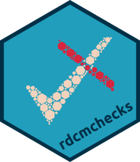

<!-- README.md is generated from README.Rmd. Please edit that file -->

# rdcmchecks <a href="https://rdcmchecks.r-dcm.org"></a>

<!-- badges: start -->

[](https://github.com/r-dcm/rdcmchecks/actions/workflows/R-CMD-check.yaml)
[](https://app.codecov.io/gh/r-dcm/rdcmchecks)
[](https://github.com/r-dcm/rdcmchecks/actions/workflows/pkgdown.yaml)
<!-- badges: end -->

The goal of rdcmchecks is to provide utility functions for checking
arguments provided to functions across the suite of r-dcm packages.
Rather than duplicating code for checking arguments across packages,
check functions can be added to rdcmchecks, which can in turn be
imported to any needed packages.

## Installation

You can install the released version of rdcmchecks from
[CRAN](https://cran.r-project.org/) with:

``` r
install.packages("rdcmchecks")
```

And the development version from [GitHub](https://github.com/) with:

``` r
# install.packages("pak")
pak::pak("r-dcm/rdcmchecks")
```

------------------------------------------------------------------------

## Contributions and Code of Conduct

Contributions are welcome. To ensure a smooth process, please review the
[Contributing Guide](https://dcmdata.r-dcm.org/CONTRIBUTING.html).
Please note that the rdcmchecks project is released with a [Contributor
Code of Conduct](https://rdcmchecks.r-dcm.org/CODE_OF_CONDUCT.html). By
contributing to this project, you agree to abide by its terms.
